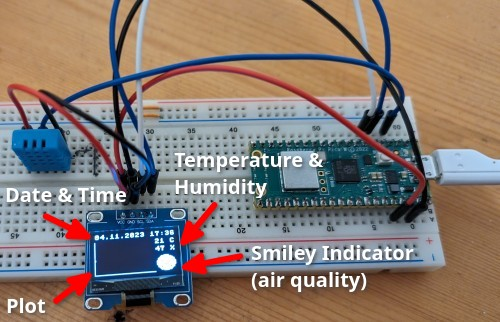
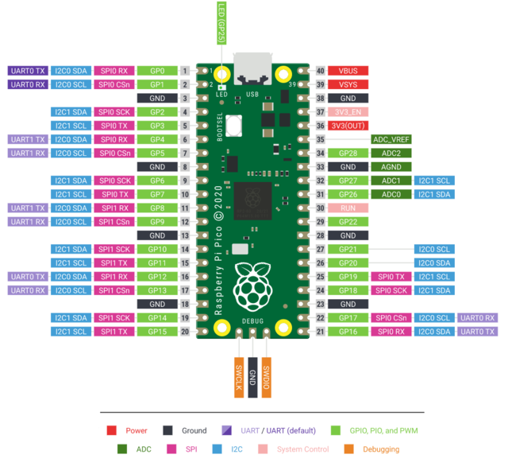

# Indoor Weather Station - Raspberry Pi Pico - MicroPython

This is a simple weather station project for the Raspberry Pi Pico. It displays temperature and humidity data from a DHT11 sensor on an SSD1306 OLED display, plots the temperature data, and shows a smiley face based on the conditions. The project also synchronizes the time using NTP (Network Time Protocol).

## Hardware Setup

### Components Needed

- Raspberry Pi Pico
- DHT11 sensor
- SSD1306 OLED display

### Wiring

- Connect the DHT11 sensor data pin to the appropriate GPIO 2 on the Raspberry Pi Pico.
- Connect the SSD1306 OLED display using the SoftI2C interface on GPIO 4 (SDA) & 5 (SCL).

Source & Copyright: [Dan Halbert](https://learn.adafruit.com/assets/99339)

## Software Setup

1. Configure your Wi-Fi network settings in a `config.py` file, see `config.py-example`. Provide your Wi-Fi SSID and password.

2. Possibly update the code with the correct I2C pins and any other pin configurations based on your hardware setup.

3. Set the NTP server to match your region. For example, if you are in Germany, use the `"datetime[4] + 1"` configuration.

4. Upload the code to your Raspberry Pi Pico.

## Running the Code

The code reads temperature and humidity data every 30 seconds from the DHT11 sensor and displays the data on the OLED display. It also plots the temperature data over time (24 hours, every 15 minutes) and shows a smiley face based on temperature and humidity conditions. The plot shows temperature data in a specified range (10 - 35 Grad Celsius) and maps it to the display for visualization.

## Troubleshooting

- If the code fails to read the sensor, you will see a "Failed to read sensor" message.

- Ensure that your Raspberry Pi Pico is properly connected to the DHT11 sensor and that you have an active Wi-Fi connection.
